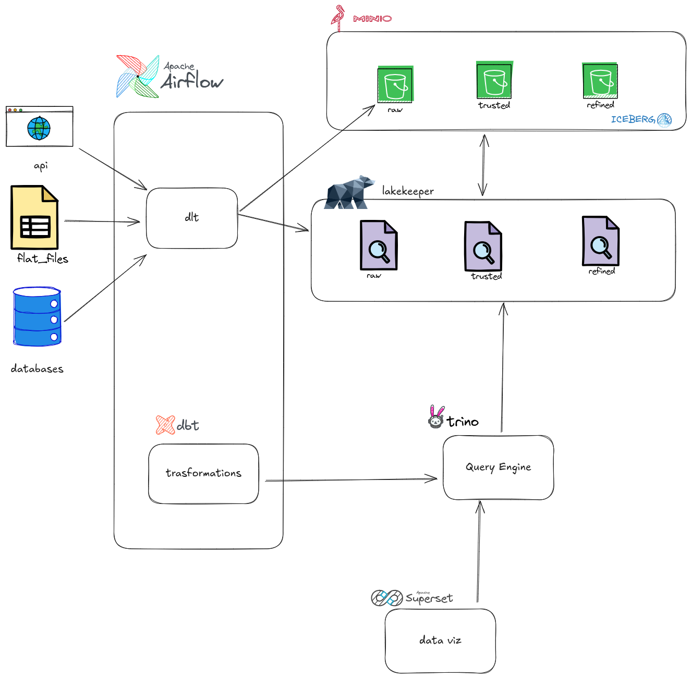

# 🛠️ Toy data platform

Este projeto define uma plataforma de dados completa utilizando `Docker Compose`, com os seguintes componentes principais:

- **Apache Airflow** (orquestração de dados)
- **MinIO** (data lake S3-compatible)
- **Lakekeeper** (catálogo de metadados para tabelas Iceberg)
- **Trino** (engine de consulta SQL distribuída)
- **Apache Superset** (BI e visualização de dados)
- **dlt** (Ingestão de dados)
- **dbt** (Transformação de dados)

---

## Arquitetura



---

# Serviços

| Serviço           | Porta | Função |
|-------------------|-------|--------|
| **Airflow Web**       | 8080  | UI para orquestração de DAGs |
| **MinIO Console**     | 9001  | Interface S3-like para dados |
| **Trino**             | 8081  | SQL Query Engine |
| **Lakekeeper**        | 8181  | Catálogo de metadados Iceberg |
| **Superset**          | 8088  | Dashboards e visualizações |
| **Postgres (Airflow)**| 5432  | Banco de metadados do Airflow |
| **Postgres (Lakekeeper)**| 5433 | Banco do catálogo Lakekeeper |
| **Postgres (Superset)**| 5434 | Banco do Superset |

---

## ⚙️ Pré-requisitos

- Docker
- Docker Compose

---

## ▶️ Instruções de uso

1. **Clone o repositório:**

   ```bash
   git clone https://github.com/seu-usuario/data-platform.git
   cd data-platform
   ```

2. **Suba os container do minio primeiramente:**

   ```bash
   docker-compose up minio
   ```

Depois, Acesse a interface do MinIO no navegador:
```
http://localhost:9000
```
- Usuário: `root`
- Senha: `rootrootroot`

e crie a chave de api que sera usada nos arquivos `.env`

voce pode cria-la acessando a url: http://localhost:9001/access-keys/new-account, copiar a chave de acesso e chave secreta e depois clicar em `create`


3. Configure as variáveis de ambiente dos serviços

A maioria das variáveis sensíveis deve ser definida nos arquivos `.env` específicos de cada serviço.
Dentro das pastas dos serviços (airflow,dbt,dlt e trino) temos arquivos `.env.sample` que podem ser usados como base para criação dos arquivos `.env`. 
Nesses arquivos `.env` nosso objetivo é preencher a credencial de access_key_id e secret_access_key que pegamos do minio.

4. Suba os containers restantes

```
docker compose up -d
```

5. **Acesse os serviços:**

   - Airflow: [http://localhost:8080](http://localhost:8080)
     - Login: `airflow` / `airflow`
   - MinIO: [http://localhost:9001](http://localhost:9001)
     - Login: `root` / `rootrootroot`
   - Trino UI: [http://localhost:8081](http://localhost:8081)
   - Superset: [http://localhost:8088](http://localhost:8088)
   - Lakekeeper: [http://localhost:8181](http://localhost:8181)
---

## 🗂️ Buckets criados automaticamente no MinIO

Ao iniciar, os seguintes buckets são criados:
``
- `raw`
- `trusted`
- `refined`

---

## 🛠️ Customizações possíveis

- Adicionar DAGs personalizados em `airflow/dags`
- Adicionar catálogos no Trino (`trino/catalog/*.properties`)
- Criar visualizações no Superset
- Integrar políticas no Lakekeeper com AuthZ (atualmente `allowall`)

---

## Testes e verificação

Para verificar se os serviços estão de pé:

```bash
docker ps
```

Você deve ver todos os containers rodando corretamente.

---

## Notas

- A configuração usa `LocalExecutor` para facilitar testes locais.
- A comunicação entre os serviços acontece via rede Docker `platform-net`.

---

## 🧑‍💻 Contribuindo

Pull Requests são bem-vindos! Sinta-se livre para abrir issues ou sugerir melhorias.
